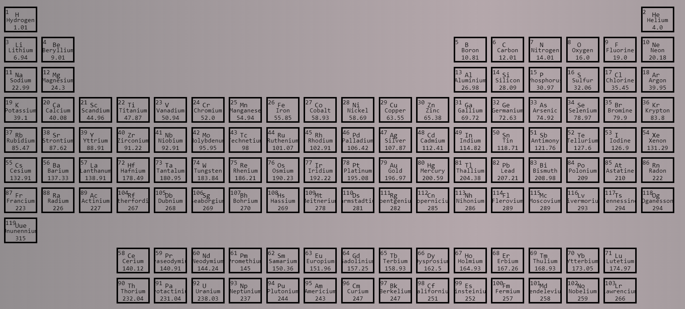
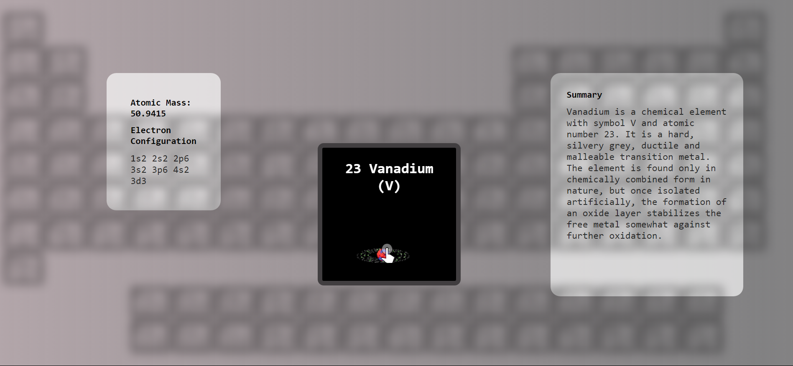

<div align="center">
    
## Periodic Table
**An Interactive Periodic Table of Elements**

---
</div>

## Table of Contents
- [Table of Contents](#table-of-contents)
- [✨Features](#✨features)
- [🔽Installation](#🔽installation)
- [📌Usage](#📌usage)
- [📸Screenshots](#📸screenshots)
- [Contributing](#contributing)
- [⚖️License](#license)
- [👤Contact](#contact)


## ✨ Features

- Interactive periodic table
- Detailed information about each element
- Search functionality

## 🔽 Installation

1. Clone the repository:
    ```bash
    git clone https://github.com/yourusername/periodic-table.git
    ```
2. Navigate to the project directory:
    ```bash
    cd Periodic_Table
    ```
3. Install dependencies:
    ```bash
    pip install -r requirements.txt
    ```
If you recieve a "No matching ditribution found for [package]" (A) it is possible you need a virtual enviornment [4-5] or (B) your machine recognizes older versions [7,9]

4. Install Virtual Environment for Python3:
    ```bash
    sudo apt-get install python3-venv
    ```
    ```bash
    python3 -m venv myenv
    ```
5. Channel into the Virtual Environment:
    ```bash
    source myenv/bin/activate
    ```
Then [3] Install Dependencies and [7] Start the application

6. Install old version dependencies:
    ```bash
    pip install -r requirements_2.txt
    ```

## 📌 Usage

7. To start the application, run:
```bash
flask --app app --debug run
```
8. Open your browser and go to `http://localhost:3000` to view the periodic table.
   
9. To start the application with old version dependencies:
```bash
export FLASK_APP=app
export FLASK_DEBUG=1
flask run
```
 
## 📸 Screenshots



## Contributing

Contributions are welcome! Please fork the repository and submit a pull request.

## ⚖️ License

This project is licensed under the MIT License.

## 👤 Contact

For any questions or feedback, please contact [prateekasme@gmail.com](mailto:prateekasme@gmail.com).
